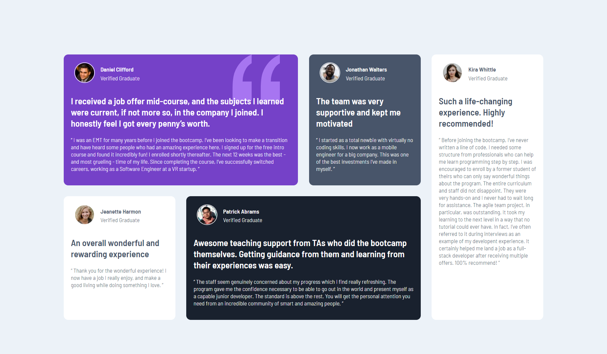

# Frontend Mentor - Testimonials grid section solution

This is a solution to the [Testimonials grid section challenge on Frontend Mentor](https://www.frontendmentor.io/challenges/testimonials-grid-section-Nnw6J7Un7).

## Table of contents

- [Overview](#overview)
  - [The challenge](#the-challenge)
  - [Screenshot](#screenshot)
  - [Links](#links)
- [My process](#my-process)
  - [Built with](#built-with)
  - [What I learned](#what-i-learned)
- [Author](#author)

## Overview

### The challenge

Users should be able to:

- View the optimal layout for the site depending on their device's screen size

### Screenshot

### Links

- Solution URL: [https://github.com/notanut/testimonial-grid-section/](https://github.com/notanut//testimonial-grid-section/)
- Live Site URL: [https://grid-testimonials-css.netlify.app/](https://grid-testimonials-css.netlify.app/)

## My process

### Built with

- Semantic HTML5 markup
- CSS custom properties
- CSS Grid

### What I learned

I learned grid-template-areas. It's so useful from CSS grid!

## Author

- Website - [Natasya](https://project-portofolio.netlify.app/)
- Frontend Mentor - [@notanut](https://www.frontendmentor.io/profile/notanut)
